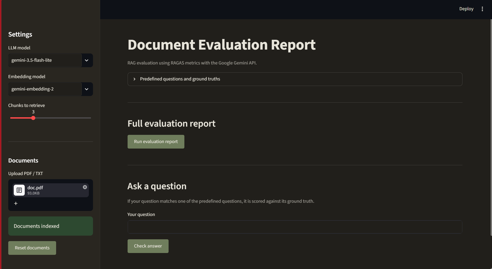

## Overview
**AI Code Companion** with RAG & vLLM is an enhanced AI-powered chatbot that serves as your personal coding assistant, offering expertise in various programming languages, debugging, code documentation, solution design, image analysis, document retrieval via Retrieval-Augmented Generation (RAG), and accelerated inference using vLLM. It’s built using Ollama, LangChain, and vLLM, providing a highly interactive, multimodal experience to help you code better, faster, and with access to your own knowledge base.

Key Features:
- 🖥 Programming Language Expert: Expertise in various programming languages for code suggestions, best practices, and solutions.
- 🐞 Debugging Assistant: Help identify bugs, suggest fixes, and strategically add print statements to debug your code.
- 📝 Code Documentation: Generates meaningful documentation for your code.
- 💡 Solution Design: Offers high-level guidance for solving complex problems or designing solutions.
- 👁️ Image Analysis: Analyzes uploaded images (e.g., code screenshots) and incorporates them into responses.
- 📚 RAG Document Retrieval: Retrieves and integrates relevant context from uploaded documents (PDFs or text files) to enhance response accuracy.
- ⚡ vLLM Acceleration: Uses vLLM for high-performance inference with models like gemma3:4b when handling uploads, enabling faster processing and summarization.
- 🧠 There are three distinct types to understand, each operating at a different layer of the stack: KV caching, Prefix caching, Semantic caching

---

## Prerequisites

### 1. System Requirements

- OS: Linux, macOS, or Windows (Linux/macOS preferred for vLLM).
- Hardware: GPU recommended for vLLM (CUDA 12.1+ for NVIDIA GPUs); CPU works for Ollama and FAISS.
- Python: Version 3.8–3.11 (vLLM is sensitive to Python versions).

### 2. Install **Ollama**
To use **Ollama** models (like `deepseek-r1:1.5b`), you'll need to have **Ollama** installed on your machine.

- Download and install **Ollama** from [https://ollama.ai/](https://ollama.ai/).
- Once installed, ensure that Ollama is running locally on your machine. You should be     able to access it via the default URL `http://localhost:11434`.
- Pull required models:
```sh
ollama pull deepscaler:latest
ollama pull nomic-embed-text
```
- Ensure Ollama server is running:
```sh
ollama serve
```

### 3. Install Required Python Libraries
Clone this repository and install the required dependencies using 
```sh
pip install -r requirements.txt
```
Optional: GPU Support
If you have a GPU and want to use **faiss-gpu** or optimize vLLM:
```sh
pip install faiss-gpu
```
Ensure CUDA is installed (check with _nvcc --version_).

### 4. Set Up vLLM Server
vLLM requires a Hugging Face model for gemma3:4b. The code uses google/gemma-2-2b-it as a placeholder (confirm the exact model ID, e.g., check Hugging Face or use a custom/local path). GPU with CUDA 12.1+ is recommended.
- Start vLLM Server:
```sh
python -m vllm.entrypoints.openai.api_server --model google/gemma-2-2b-it --dtype half --gpu-memory-utilization 0.95
```
 - Replace _google/gemma-2-2b-it_ with the correct model ID for _gemma3:4b._
 - This runs an OpenAI-compatible API at **http://localhost:8000/v1** (default port).
 - Use _--tensor-parallel-size N_ for multi-GPU setups (e.g., N=2 for 2 GPUs).
- Verify Server:
```sh
curl http://localhost:8000/v1/models
```

### 5. Run Streamlit
```sh 
streamlit run LocalLLM.py
```

## 📊 RAG Evaluation with `ragas.py`



The project now includes **`ragas.py`**, a standalone evaluation module designed to measure the quality of the Retrieval-Augmented Generation (RAG) pipeline. It enables developers to quantitatively assess how well the language model answers questions using information retrieved from uploaded documents.

Unlike `langchain_project.py`, which focuses on document ingestion, retrieval, and response generation, `ragas.py` evaluates the performance of that pipeline using industry-standard **RAGAS** metrics.

### Purpose

`ragas.py` helps validate whether the RAG system is:

- Producing factually correct answers.
- Retrieving the most relevant document chunks.
- Grounding responses in the retrieved context.
- Identifying weak retrieval or hallucination issues.
- Comparing different embedding models, chunk sizes, retrieval settings, or LLMs.

This makes it easier to improve the overall quality and reliability of the RAG application.

### Features

- 📈 Automatic evaluation of RAG responses using **RAGAS**.
- 📚 Supports uploaded **PDF** and **TXT** documents.
- 🤖 Uses **Google Gemini** as the evaluation LLM.
- 🔍 Retrieves relevant document chunks through the existing FAISS vector database.
- 📝 Evaluates predefined Question–Answer (Ground Truth) pairs.
- 🎯 Allows evaluation of individual user questions against predefined ground truths.
- 📊 Displays detailed evaluation reports inside Streamlit.
- 📉 Computes average scores across all evaluated questions.

### RAGAS Metrics Used

| Metric | Description |
|---------|-------------|
| **Answer Correctness** | Measures how accurately the generated answer matches the reference (ground truth). |
| **Answer Relevancy** | Evaluates whether the answer is relevant to the user's question. |
| **Faithfulness** | Checks whether the answer is supported by the retrieved context and avoids hallucinations. |
| **Context Precision** | Measures how much of the retrieved context is actually useful for answering the question. |
| **Context Recall** | Measures whether the retrieval step successfully retrieved all necessary information required to answer the question. |

### Evaluation Workflow

1. Upload one or more PDF or TXT documents.
2. Documents are split into chunks.
3. Chunks are embedded using Google's embedding model.
4. FAISS indexes the document embeddings.
5. Relevant chunks are retrieved for each predefined question.
6. Gemini generates an answer using only the retrieved context.
7. RAGAS compares:
   - User Question
   - Retrieved Context
   - Generated Response
   - Ground Truth
8. Individual metric scores and overall averages are displayed in a Streamlit report.

### Relationship with `langchain_project.py`

| `langchain_project.py` | `ragas.py` |
|-------------------------|------------|
| Builds the RAG chatbot | Evaluates the RAG chatbot |
| Loads and indexes documents | Uses the indexed documents |
| Retrieves relevant context | Evaluates retrieval quality |
| Generates answers | Scores generated answers |
| Supports user interaction | Measures overall RAG performance |

### Running the Evaluation

Launch the evaluation interface:

```sh
streamlit run ragas.py
```

### Requirements

Install the required libraries:

```sh
pip install ragas datasets langchain langchain-google-genai faiss-cpu pypdf nest_asyncio
```

### Typical Use Cases

- Evaluate newly added documents before deployment.
- Compare different embedding models.
- Tune chunk size and chunk overlap.
- Compare retrieval strategies.
- Benchmark different Gemini models.
- Detect hallucinations in generated answers.
- Measure improvements after prompt engineering.

### Sample Evaluation Report

Each evaluated question includes:

- User Question
- Retrieved Context
- Generated Answer
- Ground Truth
- Answer Correctness
- Answer Relevancy
- Faithfulness
- Context Precision
- Context Recall

An overall summary report is also generated, displaying the average score for each evaluation metric.

### Benefits

- Improves the reliability of the RAG pipeline.
- Provides objective quality metrics instead of manual inspection.
- Helps identify retrieval and generation weaknesses.
- Supports iterative optimization of prompts, embeddings, chunking strategies, and LLM configurations.
- Enables consistent benchmarking across different document collections and model configurations.

### Troubleshooting

- Model Not Found: Ensure models are pulled via _ollama pull_ and vLLM server is running     with the correct model ID.
- vLLM Errors: Check CUDA version and reduce _gpu-memory-utilization_ if memory is low.
- Ollama Connection: Verify **http://localhost:11434** is accessible.
- Streamlit Issues: Upgrade Streamlit with **pip install --upgrade streamlit**.


